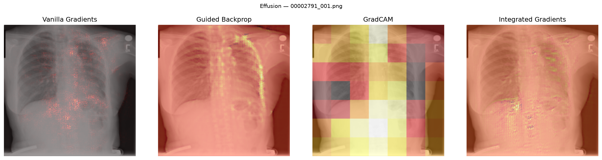
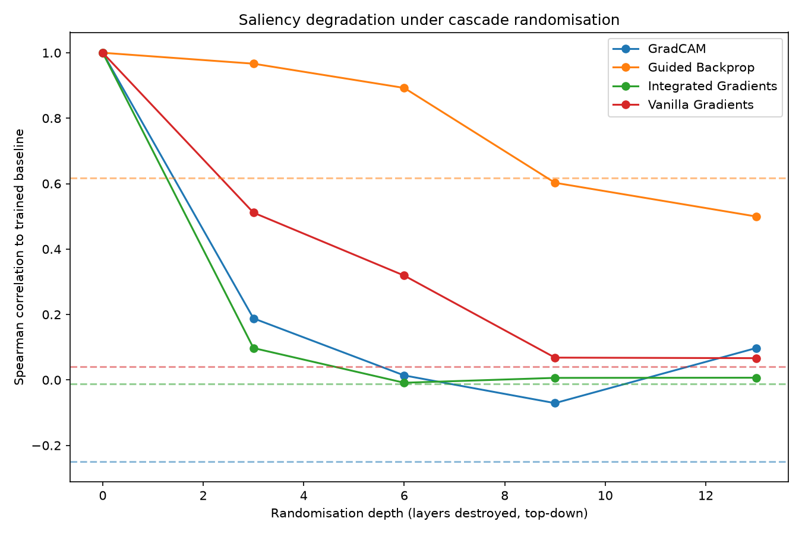
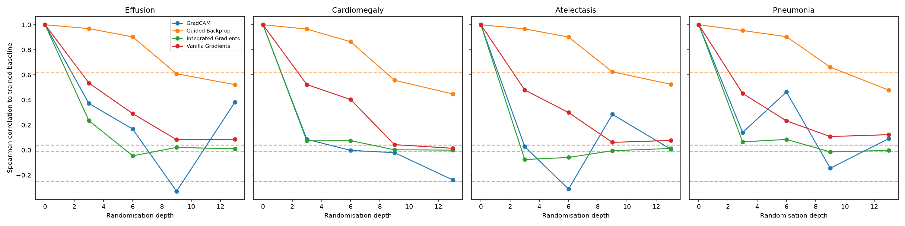

# Chest X-ray Explainability Sanity Check

Do saliency maps produced for a chest X-ray classifier reflect what the model actually learned, or are they largely properties of the input image that would look similar even if the model's weights were destroyed?



This project extends Adebayo et al.'s (2018) saliency sanity checks - originally applied to natural-image classifiers - to a real, pretrained clinical chest X-ray model, testing four widely-used explanation methods.

## Motivation

Saliency maps are increasingly proposed as a way to make deep learning models interpretable for clinicians, but a visually plausible explanation is not necessarily a faithful one. Adebayo et al. showed that several popular saliency methods produce similar-looking maps even when a model's weights are randomised - meaning the "explanation" may reflect properties of the input image rather than anything the model learned. This matters more in a clinical setting, where a misleading explanation could give false confidence in a model's reasoning.

## Methodology

**Model:** torchxrayvision's pretrained DenseNet121, trained on the CheXpert dataset (`densenet121-res224-chex`).

**Data:** a 250-image sample from the NIH ChestX-ray14 dataset (50 images per pathology: Cardiomegaly, Effusion, Pneumonia, Pneumothorax, Atelectasis), restricted to pure single-label cases to avoid comorbidity confounds.

**Saliency methods tested:** Vanilla Gradients, Guided Backpropagation, GradCAM, and Integrated Gradients (implemented via [captum](https://captum.ai/)).

**Sanity check:** cascade randomisation (Adebayo et al., 2018) - the model's weights are progressively reinitialised top-down (classifier → final conv block → ... → input stem), and saliency maps are regenerated at each depth. A faithful method's explanation should change substantially as the weights are destroyed; a method that mostly reflects the input image will produce similar maps throughout.

**Metrics:** Spearman rank correlation and structural similarity (SSIM) between each depth's saliency map and the fully-trained baseline.

**Null comparison:** in addition to Adebayo's original trained-vs-randomised test, this project adds a random-vs-random comparison - two independently, fully-randomised models compared against each other - to distinguish genuine weight-dependence from similarity driven purely by shared architecture or the strong anatomical structure common to all chest X-rays.

## Results



**Guided Backpropagation fails the sanity check.** Its similarity to the trained baseline barely drops as the model is destroyed - Spearman correlation falls only from 1.0 (untouched model) to 0.50 at full randomisation, staying close to its own random-vs-random null of 0.62. In other words, a version of this model with every learned weight replaced by noise produces an explanation nearly as similar to the original as the trained model's own explanation would. This means Guided Backprop's maps are largely insensitive to whether the model has learned anything about chest X-rays at all - the method would look just as convincing on a model that had never been trained.

**Vanilla Gradients and Integrated Gradients pass the sanity check.** Both methods degrade sharply and early: by full randomisation, Vanilla Gradients drops to 0.07 and Integrated Gradients to 0.01, both landing close to their respective near-zero null lines (0.04 and -0.01). This indicates these methods' explanations are truly tied to the model's learned weights - destroy the weights, and the explanation changes accordingly, as a faithful explainability method should.

**GradCAM shows a partial, less certain pass.** Like the two passing methods, it degrades early rather than staying elevated - but its own null line sits unusually low (-0.25), and its final value (0.10) leaves a smaller relative gap above that null than Vanilla Gradients or Integrated Gradients achieve. More importantly, GradCAM's behaviour is far more inconsistent across individual images than the other three methods (see the distribution analysis in `results.md`.): its degradation curve dips sharply then partially recovers in several pathology panels, and its spread across images at full randomisation ranges from roughly -0.65 to +0.65 - the widest of any method by a large margin. This means GradCAM's appears to pass the sanity checks on average, but is still noisy and less reliable image-by-image than the cleaner, more consistent pass shown by Vanilla Gradients and Integrated Gradients.

**This ranking - Guided Backprop worst, GradCAM/Vanilla/Integrated Gradients better - held consistently across all four pathologies tested** (Effusion, Cardiomegaly, Atelectasis, Pneumonia), meaning the finding is not an artifact of any single pathology dominating the aggregate result.



Full results, per-pathology breakdown, and metric-agreement checks: see [`results.md`](results.md).

## Interpretation

This does not mean saliency maps are useless, or that clinicians should abandon explainable AI - it means specific methods currently in use, including one (Guided Backprop) common in medical imaging literature, may not reflect what a clinical model actually learned. The choice of explanation method matters, and that choice should be informed by sanity checks like this one, not by visual appeal alone.

## Limitations

- Small sample (15 images used in the randomisation experiment; 250 in the base dataset) due to compute and time constraints - see `results.md` for the full list.
- One model architecture, one training checkpoint; findings are not claimed to generalise beyond this setup.
- Domain shift between the model's CheXpert training data and the NIH test images used here meaningfully reduced the pool of confidently-classified images per pathology (see `notebooks/01_setup.ipynb`); Pneumothorax had none above the confidence threshold and was excluded from later experiments.

## Reproducing this project

```bash
pip install torch torchvision captum torchxrayvision numpy scipy scikit-image matplotlib pandas
```

**Prerequisite:** download and extract the 12 NIH ChestX-ray14 zip archives from [the official source](https://nihcc.app.box.com/v/ChestXray-NIHCC) - no credentialing required. NIH images are not included in this repository (see `.gitignore`) due to size and redistribution terms.

Run notebooks in order:
1. `00_dataset_sampling.ipynb` — samples a balanced 250-image subset and copies matching files into `data/`
2. `01_setup.ipynb` — loads the pretrained model, validates predictions on the sampled data
3. `02_saliency_methods.ipynb` — implements and tests the four saliency methods
4. `03_baseline_saliency_grid.ipynb` — generates the baseline saliency comparison grid
5. `04_randomisation_experiment.ipynb` — runs the cascade randomisation sanity check
6. `05_results_analysis.ipynb` — produces the degradation curves and final analysis

## Project structure
chest_xray_xai/
├── README.md
├── results.md
├── src/
│ ├── config.py
│ ├── data.py
│ ├── saliency.py
│ └── randomisation.py
├── notebooks/
│   ├── 00_dataset_sampling.ipynb
│   ├── 01_setup.ipynb
│   ├── 02_saliency_methods.ipynb
│   ├── 03_baseline_saliency_grid.ipynb
│   ├── 04_randomisation_experiment.ipynb
│   └── 05_results_analysis.ipynb
├── results/
│ └── sanity_check_scores.csv
├── figures/
│ ├──baseline_saliency_grid.png
│ ├──degradation_curves.png
│ ├──degradation_curves_by_pathology.png
│ ├──degradation_curves_spearman_vs_ssim.png
│ └──final_depth_distribution.png


## References

Adebayo, J., Gilmer, J., Muelly, M., Goodfellow, I., Hardt, M., & Kim, B. (2018). Sanity Checks for Saliency Maps. *NeurIPS*.