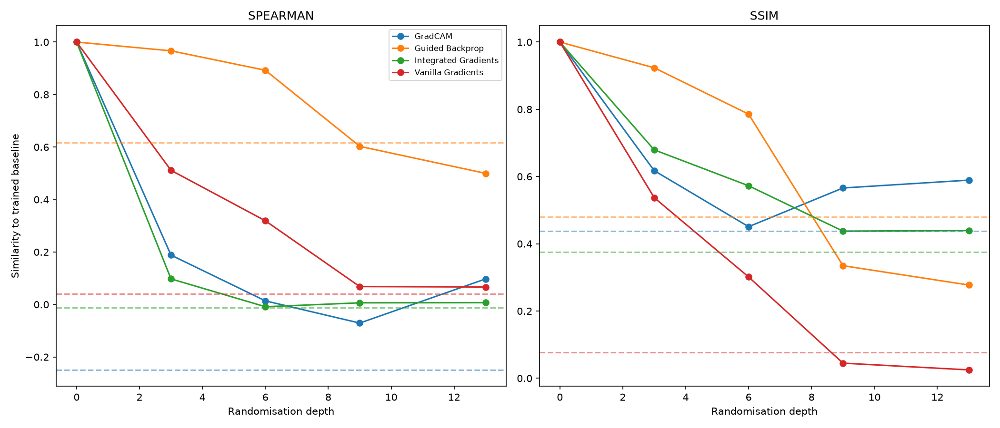
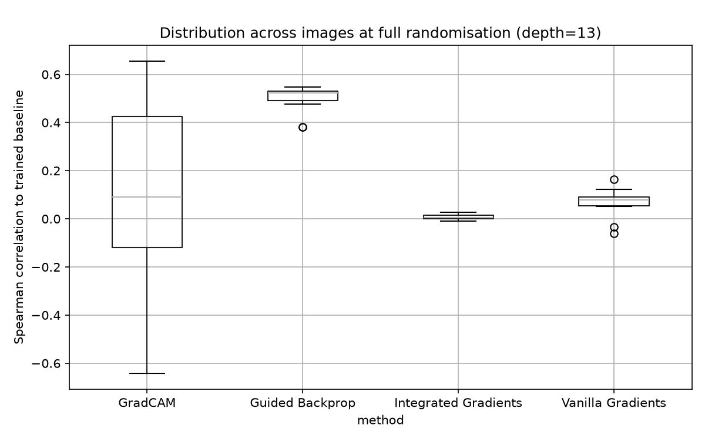

# Sanity Check Results

**Setup:** N=15 confidently-classified images (≥0.7 true-label probability), 5 randomisation depths (0, 3, 6, 9, 13 layers, top-down), CheXpert-pretrained DenseNet121, tested on NIH ChestX-ray14 images, across 4 pathologies (Effusion, Cardiomegaly, Atelectasis, Pneumonia).

## Which methods pass / fail

The critical comparison throughout is not a method's raw similarity score, but that score **relative to its own random-vs-random null** - the similarity two independently, fully-randomised models produce on the same image, with zero shared learned information. A method whose trained-vs-randomised curve converges toward its own null line has stopped reflecting the model's learned weights at all; a method that stays well above its null retains spurious "trained-model-like" behaviour despite the weights being destroyed.

*Spearman correlation to the trained baseline, per method, across randomisation depth. Dashed lines show each method's random-vs-random null.*

**Guided Backpropagation clearly fails the sanity check.** It is the only method that remains substantially elevated across the entire randomisation sweep - Spearman correlation to the trained baseline stays above 0.5 even at full randomisation (depth 13: 0.50), only marginally below its own null (0.62). This means Guided Backprop's explanations are largely insensitive to whether the model has learned anything at all, consistent with Adebayo et al.'s (2018) original finding on natural images - and this project extends that finding to a clinical chest X-ray classifier.

**Vanilla Gradients and Integrated Gradients pass the sanity check.** Both degrade rapidly and converge close to their respective (near-zero) null lines by depth 13 (Vanilla Gradients: 0.07 vs. null 0.04; Integrated Gradients: 0.01 vs. null -0.01), indicating their explanations are truly dependent on the model's learned weights, not merely on input structure.

**GradCAM is a more ambiguous pass.** Its curve drops sharply and early (0.19 by depth 3), similarly to Vanilla/Integrated, but its null line itself sits unusually low (-0.25) and its final value (0.10) is noticeably above that null - a smaller relative gap than Vanilla or IG achieve. GradCAM's behaviour is also the most volatile of the four methods (see distribution analysis below), which limits confidence in this being a stable, reliable pass rather than a noisy one.

## Pathology variation

The ranking of methods (Guided Backprop worst, GradCAM/Vanilla/Integrated Gradients better) holds consistently across all four pathologies tested (Effusion, Cardiomegaly, Atelectasis, Pneumonia) - the primary finding is not driven by any single pathology. GradCAM's volatility is visible in every panel (a sharp dip around mid-depth followed by partial recovery), most pronounced for Effusion and Atelectasis. Pneumothorax could not be evaluated - no images in the 250-image sample reached the ≥0.7 confidence threshold for this class (see `03_baseline_saliency_grids.ipynb`).

*Same comparison as above, split by pathology, confirming the method ranking holds consistently across all four classes tested.*

## Spearman vs. SSIM agreement

Both metrics produce the same overall shape and ranking - Guided Backprop remains highest throughout, Vanilla Gradients and Integrated Gradients converge lowest - supporting that this finding is not an artifact of either similarity metric's specific sensitivity. SSIM additionally shows Vanilla Gradients dropping *below* its own null line at high depth, a slightly stronger failure signal for that method than Spearman alone suggests.

*Spearman and SSIM shown side by side - both metrics agree on the overall ranking and shape of degradation across methods.*

## Distribution / reliability

At full randomisation, Guided Backprop and Integrated Gradients show tight, consistent distributions across the 15 test images, supporting confidence in their results. GradCAM shows the widest spread by a large margin (ranging from roughly -0.65 to +0.65 across images) - meaning its apparent "pass" is considerably less stable at the individual-image level than the aggregate curve alone suggests, and should be treated with more caution than the other three methods' results.

*Spread of Spearman scores across individual images at full randomisation (depth 13), showing GradCAM's markedly higher variance relative to the other three methods.*

## What this project establishes

Specific saliency methods, applied to a pretrained clinical chest X-ray model, do not uniformly reflect the model's learned weights. Guided Backpropagation in particular produces explanations that remain largely unchanged even when the model's weights are destroyed - a clinically important finding, since a practitioner relying on this method could be shown a confident-looking explanation from a model that has, in effect, learned nothing.

## What this project does not establish

- That no saliency method is useful in clinical settings (Vanilla Gradients and Integrated Gradients showed true weight-sensitivity here).
- That these findings generalise beyond this specific model checkpoint (CheXpert-trained DenseNet121) or beyond the pathologies tested.
- That a method passing this sanity check is therefore clinically *accurate* - sanity-check passing is a necessary, not sufficient, condition for a trustworthy explanation.

## Limitations

- Small sample: 15 images (not the originally planned 100), due to time and compute constraints.
- 5 randomisation depths tested (0, 3, 6, 9, 13 of 13 layers), not all 13 individually - finer depth resolution could reveal transition points not captured here.
- CPU-only hardware; Integrated Gradients used `n_steps=20` and `internal_batch_size=5`, not the originally planned `n_steps=50`.
- Domain shift between CheXpert (training distribution) and NIH ChestX-ray14 (test distribution) substantially reduced the pool of confidently-classified images per pathology (documented in `01_data_exploration.ipynb`); Pneumothorax had zero images clearing the confidence threshold and was excluded entirely from both the baseline saliency grid and this experiment.
- One model, one architecture (DenseNet121) - findings are specific to this checkpoint, not a general claim about chest X-ray classifiers.
- GradCAM's high per-image variance (see distribution analysis) means its sanity-check outcome should be treated as less certain than the other three methods'.

## Hypotheses revisited

- **H1** (method-level: non-conv methods degrade more than conv-based ones) - **not supported as stated**. GradCAM (conv-based) degraded comparably to Vanilla/Integrated Gradients, while Guided Backprop (not conv-based) was the clear outlier that failed to degrade. Method architecture alone does not predict sanity-check behaviour here.
- **H2** (domain-transfer: X-ray sanity-check failures smaller than natural-image literature) - **not directly testable** with this experiment design; no natural-image baseline was run for comparison. Left as a documented gap rather than a claim.
- **H3** (pathology-dependent pass/fail) - **not supported**: method ranking was consistent across all four testable pathologies. Pathology-level differences in absolute values exist but don't reorder which methods pass or fail.